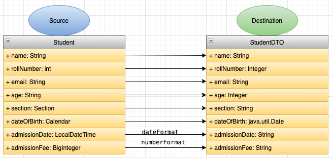

### Data type conversion in MapStruct

In most of the mapping scenarios mapped attribute has the same type in the source and target objects, but there are some scenario where mapped attribute can have different data types in the source and target objects. For example Student entity have rollNumber type as int  whereas in StudentDTO  rollNumber type is Integer.

MapStruct does basic type conversions automatically like:

	- All java primitive and their corresponding wrapper types (vice versa Wrapper -> Primitive)
	- All Java primitive/wrappers and their corresponding String (vice versa String -> Primitive/Wrapper)
	- Between java.time.ZonedDateTime, java.time.LocalDateTime, java.time.LocalDate, java.time.LocalTime from Java 8 Date- 	  	 Time package and String. A format string as understood by java.text.SimpleDateFormat can be specified via the 		  dateFormat option
	- Most of date conversions are defined by Mapstruct automatically

For more information about automatic conversion, please check below link:
https://mapstruct.org/documentation/stable/reference/html/#implicit-type-conversions

There are some cases where you want to define the format of mapped attributes in destination object like date format and number format for this MapStruct defined some formatter like:

	 - dateFormat
	 - numberFormat

